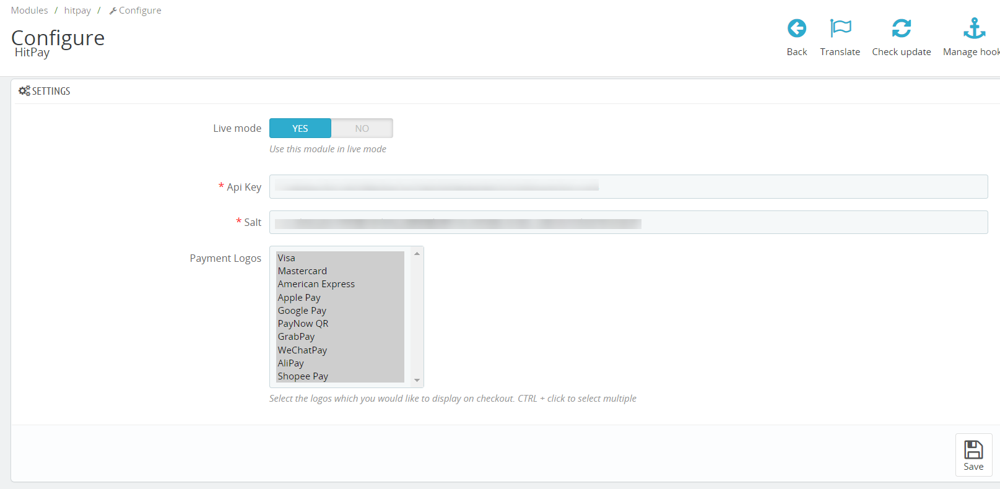
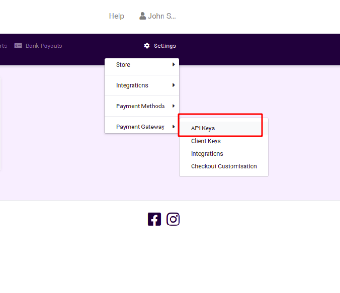
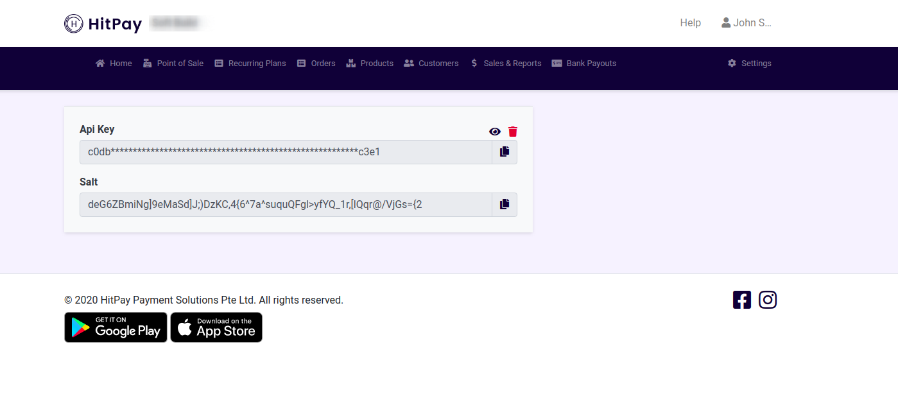
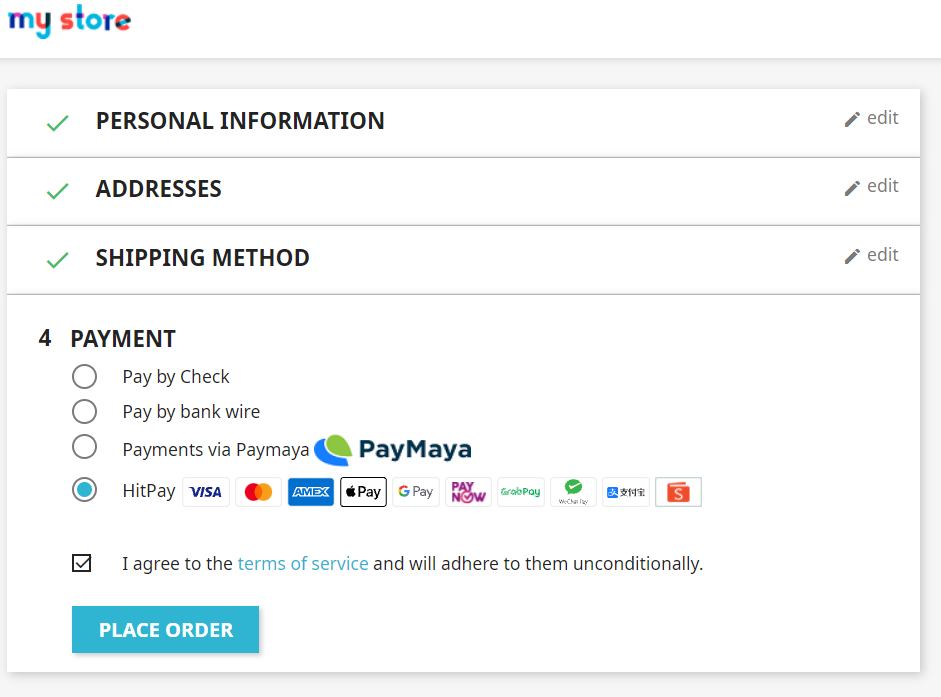
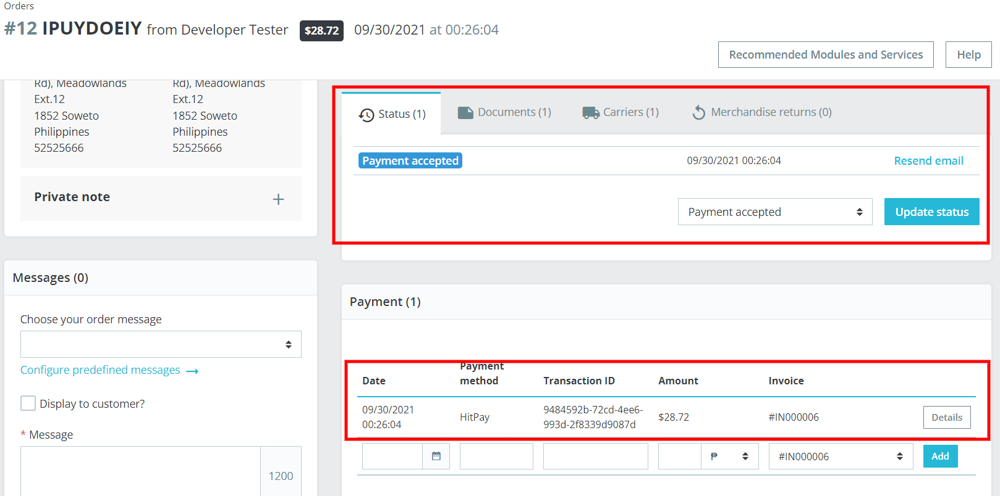
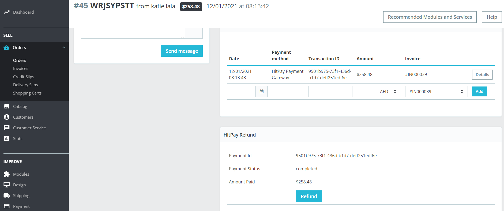
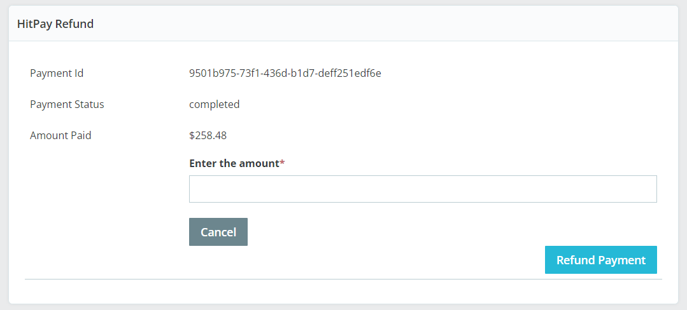
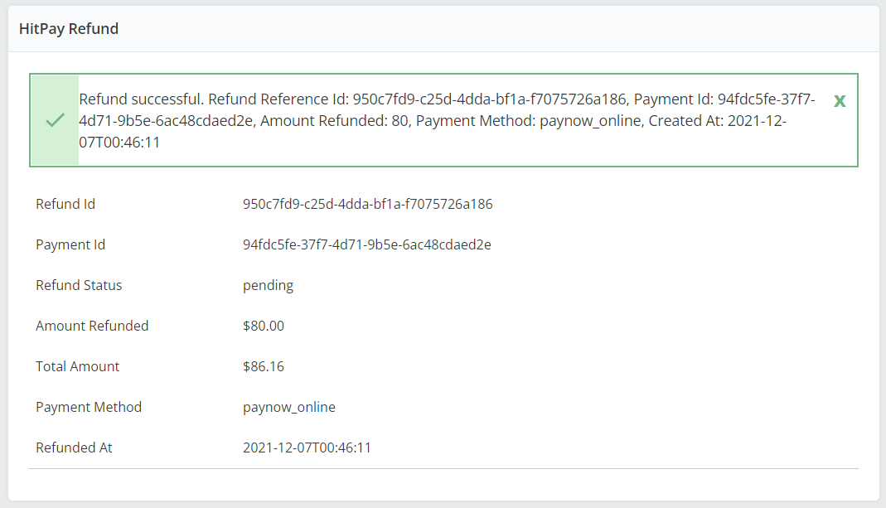

# HitPay 

## Installing

== Method 1: ==

1. Need to download the repository via composer
2. Execute:
```shell
cd path/to/project/modules/hitpay;
composer install;
```
== Method 2: ==

1. Or download the latest released packaged from (https://github.com/hit-pay/prestashop1.7-extension/releases)
2. And upload via FTP.
3. Upload the files to under path/to/project/modules/hitpay/ folder.
4. If hitpay folder does not exist under modules, create one.

== Install ==

1. If you followed either Method 1 or Method 2, you need to navigate IMPROVE => Modules => Modules Catalog
2. Enter 'HitPay' in the search field.
3. Click 'Install' button to install the module.


## Upgradation

== Method 1: ==

1. If you update/upgrade the module, need to execute:
```shell
cd path/to/project/modules/hitpay;
composer update;
```
== Method 2: ==

1. Or download the latest released packaged from (https://github.com/hit-pay/prestashop1.7-extension/releases)
2. And upload via FTP.
3. Upload/Replace/Merge the files to under path/to/project/modules/hitpay/ folder.

== Update ==

1. If you followed either Method 1 or Method 2, you need to navigate IMPROVE => Modules => Modules Manager
2. Enter 'HitPay' in the search field.
3. Click 'Upgrade' button to update the module. It is very important, otherwise latest updates will not be available in the module and module may not work properly.

## Configuration

1. Go to prestashop configuration page:

2. Go to dashboard of hitpay:


3. Copy api key and salt from hitpay dashboard to prestashop module in the same named fields

## Using

1. Payment

2. Checking orders


## Refunds

1. Log in to admin
2. Navigate to SELL ⇒ Orders ⇒ Orders
3. Navigate to Admin Order View Details
4. If order is paid via 'HitPay Payment Gateway' and payment is successful and transaction id saved on the Database, then following screen will be displayed in the Admin Order view:

5. Click blue colored 'Refund' Button, this will show the below screen:

6. You can enter Full amount or Partial amount, but 0 or greater than total paid will not be allowed.
7. Click blue colored 'REFUND PAYMENT' button to initiate the Refund. If gateway accepted the refund request and the Refund details will be displayed like the below screen:
8. If full amount is refunded, then order status will be changed to 'Refunded' automatically.
9. Only one refund is allowed per transaction.
10. Refund is only applicable if the initial charge was made with PayNow or Card.


## Changelog

= 1.0.0 =
* Initial release.

== Upgrade Notice ==

= 2.0.0 =
- HitPay payment details displayed under admin order total section
- Added purpose field to the gateway
- Merchants can enter their own payment title which will display during the checkout.
- Merchants can choose their own order status which would be set upon successful payment.

= 2.0.1 =
- HitPay SDK included within the package

= 2.0.2 =
- Refund currency display issue in the admin
- Fixed: Error message: Call to protected method ToolsCore::getContextLocale() from context 'Hitpay'

= 2.0.3 =
- Drop-in Feature Included

= 2.0.4 =
- New logos are added